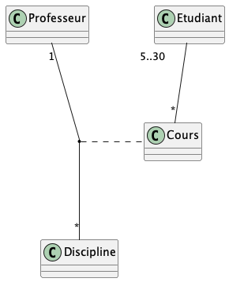

# Diagramme de classe

## Vrai ou faux

Etant donné le diagramme de domaine ci-dessus, les assertions suivantes sont-elles vraies ou fausses ? 
- Etudiant est une classe d’association
  - Faux : La classe d’association est le Cours
- Un étudiant peut participer à autant de cours qu’il veut
  - Vrai : La cardinalité de l’association Etudiant-Cours est * dans ce sens
- Plusieurs professeurs peuvent enseigner la même discipline
  - Faux : La cardinalité de l’association Professeur-Discipline est 1 dans ce sens 
- Un professeur peut enseigner plusieurs disciplines
  - Vrai : La cardinalité de l’association Professeur-Discipline est * dans ce sens  
- Un cours peut être enseigner à 2 étudiants
  - Faux : La cardinalité de l’association Cours-Etudiant spécifie un minimum de 5 étudiants 
- Un cours peut être enseigner à 20 étudiants 
  - Vrai : La cardinalité de l’association Cours-Etudiant spécifie entre 5 et 30 étudiants, ce qui inclut 20

## Question ouverte

Représentez la même association avec la notation UML « petit losange » 

- Quelles informations perd-on par rapport au diagramme ci-dessus ? 